# 왜 이 테스트를 진행했는가

현재 `lucida-builder-r3` 프로젝트에서 **WebFlux + Coroutine** 기반의 datasource 모듈을 사용하고 있다. 최근 Coroutine과 WebFlux를 학습하면서, 이 기술 스택이 단순 MVC 대비 **실제로 얼마나 성능 향상을 가져오는지** 직접 눈으로 확인하고 싶었다.

이론으로만 알고 있던 "논블로킹이 빠르다"를 **숫자로 증명**하고, 동시에 "MVC에서 Coroutine만 붙이면 되는 거 아니야?"라는 흔한 오해도 데이터로 검증하고자 했다.

---

# 테스트 환경

## Hardware & OS

| 항목 | 스펙 |
|------|------|
| Machine | Apple Silicon Mac |
| RAM | 48GB |
| OS | macOS (Darwin 25.4.0) |
| JDK | Liberica JDK 21.0.6 |
| JVM Heap | `-Xms512m -Xmx512m` (양쪽 동일) |

## Software Stack

| 항목 | 버전 |
|------|------|
| Spring Boot | 3.4.1 |
| Kotlin | 2.1.0 |
| Coroutines | 1.8.1 |
| Docker Desktop | 4.67.0 |
| MongoDB | 7.0 |
| MySQL | 8.0 |
| Prometheus + Grafana | latest |
| toxiproxy | latest |

## JMeter 공통 설정

| 항목 | 값 |
|------|-----|
| Number of Threads | **500** (별도 명시 없는 한) |
| Ramp-Up Period | 30초 |
| Duration | 60초 |
| Endpoint | `GET /api/users` |

## 모니터링

```
Grafana (localhost:3000) ← Prometheus (localhost:9090) ← Spring Actuator
```

JVM Heap, Thread Count, CPU Usage, GC Pause 등을 실시간 모니터링하며 테스트 진행.

---

# 아키텍처 구성도

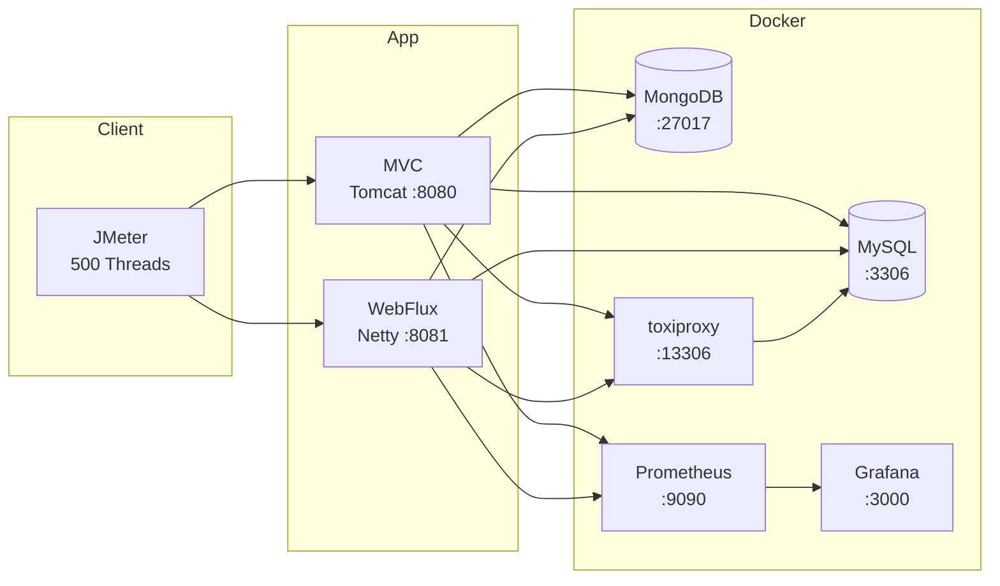

---

# Round 1: MongoDB — MVC vs WebFlux + Coroutine

> **질문: 블로킹 vs 논블로킹 전체 스택, 얼마나 차이 나는가?**

## 구성

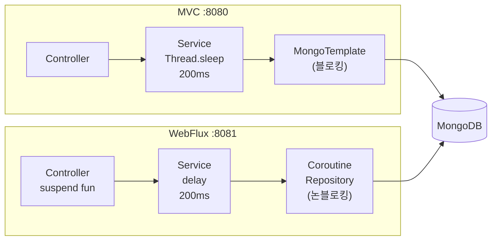

| 항목 | MVC | WebFlux + Coroutine |
|------|-----|---------------------|
| Framework | Spring MVC (Tomcat) | Spring WebFlux (Netty) |
| DB Driver | MongoTemplate (블로킹) | ReactiveMongoTemplate + CoroutineCrudRepository |
| Delay 방식 | `Thread.sleep(200ms)` — 스레드 점유 | `kotlinx.coroutines.delay(200ms)` — 스레드 해방 |

## 소스코드

**MVC — Service (블로킹)**

```kotlin
@Service
class UserService(
    private val userRepository: UserRepository,  // MongoRepository (블로킹)
    @Value("\${app.simulate-delay-ms:0}") private val simulateDelayMs: Long
) {
    private fun simulateIoDelay() {
        if (simulateDelayMs > 0) {
            Thread.sleep(simulateDelayMs)  // 스레드 점유 — Tomcat 스레드가 200ms 동안 블로킹
        }
    }

    fun findAll(): List<User> {
        simulateIoDelay()
        return userRepository.findAll()
    }
}
```

**WebFlux + Coroutine — Service (논블로킹)**

```kotlin
@Service
class UserService(
    private val userRepository: UserRepository,  // CoroutineCrudRepository (논블로킹)
    @Value("\${app.simulate-delay-ms:0}") private val simulateDelayMs: Long
) {
    fun findAll(): Flow<User> = userRepository.findAll().onStart {
        if (simulateDelayMs > 0) {
            delay(simulateDelayMs)  // 스레드 해방 — 코루틴 중단 후 다른 요청 처리 가능
        }
    }

    suspend fun findById(id: String): User {
        if (simulateDelayMs > 0) {
            delay(simulateDelayMs)
        }
        return userRepository.findById(id) ?: throw NoSuchElementException("User not found: $id")
    }
}
```

> **핵심 차이**: `Thread.sleep`은 현재 스레드를 200ms 동안 점유한다. `delay`는 코루틴을 중단(suspend)하고 스레드를 해방하여 다른 요청을 처리할 수 있게 한다.

## 결과

| 지표 | MVC | WebFlux | 배수 |
|------|-----|---------|------|
| **Samples** | 52,461 | **106,184** | 2.0x |
| **Avg Latency (ms)** | 431 | **211** | 2.0x 빠름 |
| **Max Latency (ms)** | 657 | **297** | 2.2x 빠름 |
| **Std. Dev.** | 143.77 | **9.06** | 15.9x 안정 |
| **Throughput (req/s)** | 865 | **1,763** | 2.0x |
| **Error %** | 0% | 0% | 동일 |

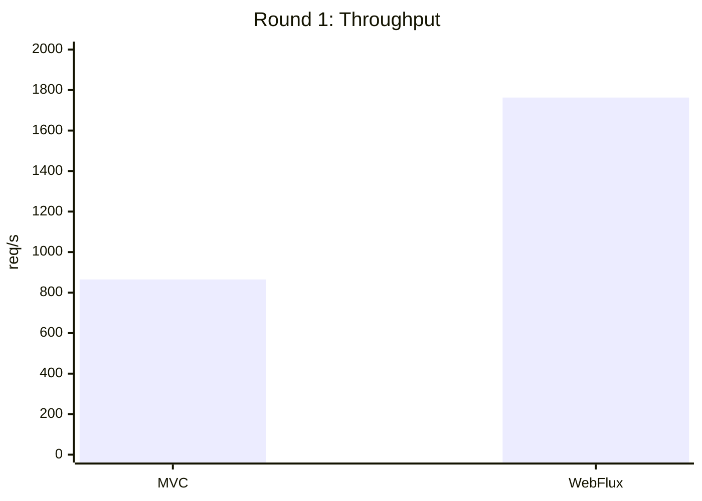

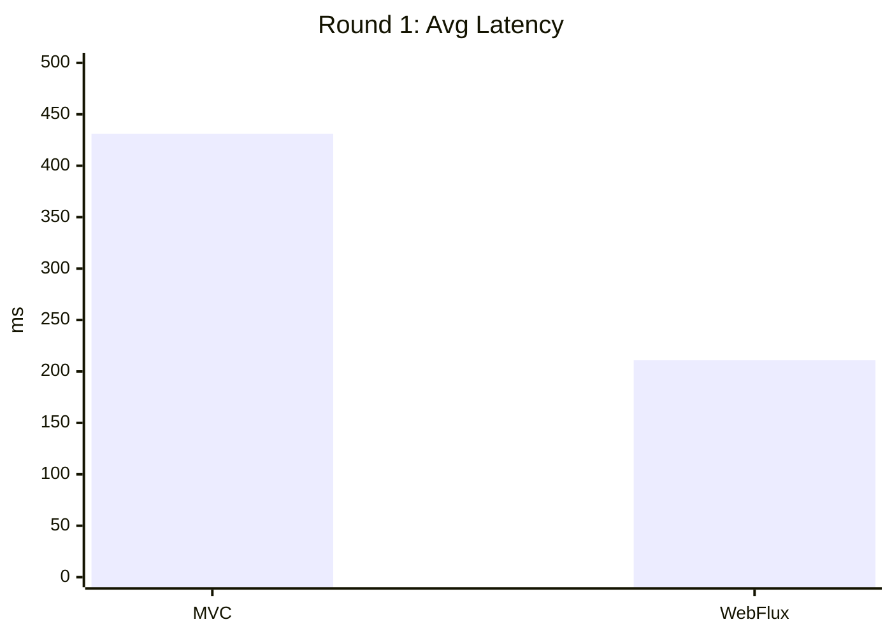

## 분석

- **WebFlux가 MVC 대비 처리량 2배, 응답 속도 2배.**
- MVC는 Tomcat 스레드풀(기본 200개)이 포화되면 나머지 300개 요청이 큐에서 대기. `Thread.sleep(200ms)`이 스레드를 점유하기 때문.
- WebFlux는 Netty 이벤트 루프(CPU 코어 수만큼) + 코루틴으로 스레드를 해방하므로 스레드풀 병목이 없음.
- **Std.Dev 9.06 vs 143.77** — WebFlux는 응답 시간이 극도로 일정. MVC는 스레드풀 대기로 편차가 큼.

---

# Round 2: MVC에서 Coroutine을 쓰면 성능이 좋아질까?

> **질문: WebFlux 없이 MVC + suspend fun만으로 성능 이점을 얻을 수 있는가?**

## 테스트 2-a: suspend fun만 추가

Controller를 `suspend fun`으로 변경하되, 블로킹 드라이버(MongoTemplate)와 `Thread.sleep`은 그대로 유지.

```kotlin
// Controller — suspend fun 키워드만 추가
@GetMapping
suspend fun findAll(): List<User> = userService.findAll()

// Service — 내부는 여전히 블로킹
suspend fun findAll(): List<User> {
    Thread.sleep(simulateDelayMs)  // suspend fun이지만 Thread.sleep은 스레드를 점유
    return userRepository.findAll()  // MongoRepository — 블로킹 드라이버
}
```

| 지표 | MVC (일반 fun) | MVC + Coroutine (suspend fun) |
|------|---------------|------------------------------|
| Samples | 52,461 | 52,175 |
| Avg (ms) | 431 | 433 |
| Throughput | 865 req/s | 863 req/s |

> **결론: 차이 없음.** `suspend fun`을 붙여도 내부에서 `Thread.sleep`으로 블로킹하면 스레드가 점유된다. 코루틴 키워드만으로는 논블로킹이 되지 않는다.

## 테스트 2-b: Dispatchers.IO로 오프로딩

블로킹 작업을 `withContext(Dispatchers.IO)`로 감싸서 Tomcat 스레드 해방을 시도.

```kotlin
suspend fun findAll(): List<User> = withContext(Dispatchers.IO) {
    Thread.sleep(200)  // IO 스레드에서 블로킹
    userRepository.findAll()
}
```

| 지표 | MVC | MVC + Dispatchers.IO |
|------|-----|---------------------|
| Samples | 52,461 | **18,566** |
| Avg (ms) | 431 | **1,233** |
| Throughput | 865 req/s | **301 req/s** |

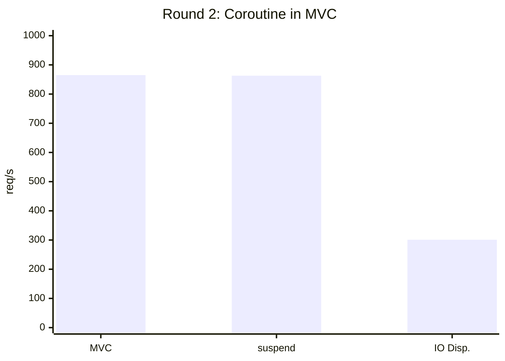

> **결론: Dispatchers.IO를 쓰면 오히려 3배 악화.** Tomcat 스레드는 해방되지만, `Dispatchers.IO` 기본 스레드풀(64개)이 새로운 병목이 된다. 500명 × 200ms = IO 풀 포화. 블로킹 자체가 사라지는 게 아니라 **병목이 이동**할 뿐이다.

---

# Round 3: 코루틴 병렬 호출의 효과

> **질문: MVC에서 코루틴의 진짜 가치인 병렬 호출은 효과가 있는가?**

## 구성

3개의 독립적인 DB 호출을 하나의 엔드포인트(`/api/users/aggregate`)에서 실행.

**MVC — 순차 호출**

```kotlin
// 3개 메서드를 순차적으로 호출 — 각각 200ms delay
fun aggregate(): Map<String, Any> {
    val users = findAll()       // 200ms (Thread.sleep)
    val count = count()         // 200ms (Thread.sleep)
    val first = findFirst()     // 200ms (Thread.sleep)
    return mapOf(               // Total: ~600ms
        "users" to users,
        "count" to count,
        "first" to (first ?: "none")
    )
}
```

**MVC + Coroutine — 병렬 호출**

```kotlin
// async로 3개 메서드를 동시에 실행 — Dispatchers.IO에서 병렬 처리
suspend fun aggregate(): Map<String, Any> = coroutineScope {
    val usersDeferred = async { findAll() }     // 200ms ─┐
    val countDeferred = async { count() }       // 200ms ─┤ 동시 실행
    val firstDeferred = async { findFirst() }   // 200ms ─┘

    val users = usersDeferred.await()           // Total: ~200ms (이론상)
    val count = countDeferred.await()
    val first = firstDeferred.await()
    mapOf("users" to users, "count" to count, "first" to (first ?: "none"))
}

// 각 메서드는 Dispatchers.IO에서 블로킹
suspend fun findAll(): List<User> = withContext(Dispatchers.IO) {
    Thread.sleep(simulateDelayMs)
    userRepository.findAll()
}
```

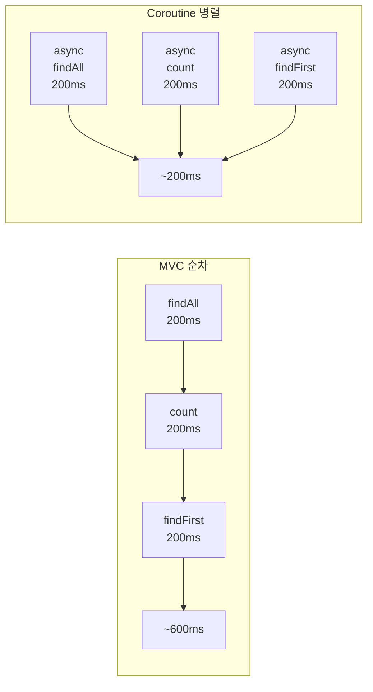

## 500 Threads 결과

| 지표 | MVC 순차 | Coroutine 병렬 |
|------|---------|---------------|
| Samples | 18,038 | 6,685 |
| Avg (ms) | 1,269 | **3,546** |
| Min (ms) | 603 (≈3×200ms) | 204 (≈200ms) |
| Throughput | **293 req/s** | 103 req/s |

> **500명 동시 접속에서는 순차가 3배 빠름.** 병렬 호출이 500명 × 3 = 1,500개 작업을 IO 스레드풀(64개)에 몰아넣어 병목 발생.

## 50 Threads 결과

| 지표 | MVC 순차 | Coroutine 병렬 |
|------|---------|---------------|
| Samples | 3,714 | **5,642** |
| Avg (ms) | 614 | **402** |
| Min (ms) | 604 | 202 |
| Throughput | 61 req/s | **93 req/s** |

> **50명에서는 병렬이 1.5배 빠름.** IO 스레드풀에 여유가 있어 병렬 실행의 이점이 살아남.

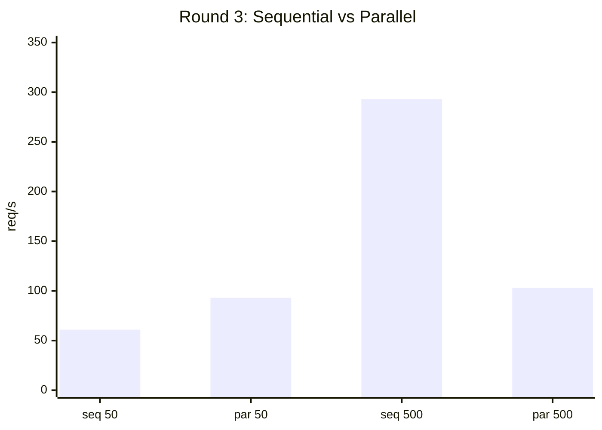

## 분석

| 동시 사용자 | 코루틴 병렬 효과 | 이유 |
|-----------|----------------|------|
| **적음 (50명)** | 효과 있음 (1.5배) | IO 스레드풀에 여유 |
| **많음 (500명)** | **오히려 악화 (3배 느림)** | IO 스레드풀이 새로운 병목 |

> **MVC에서 코루틴 병렬 호출은 저부하에서만 효과가 있다.** 고부하에서는 `Dispatchers.IO` 스레드풀이 포화되어 역효과.

---

# Round 4: MySQL — MVC + JPA vs WebFlux + R2DBC

> **질문: DB를 바꿔도 결과가 동일한가?**

## 구성

| 항목 | MVC | WebFlux |
|------|-----|---------|
| DB Driver | **JPA + HikariCP** (블로킹) | **R2DBC + Coroutine** (논블로킹) |
| Connection Pool | HikariCP (max 10) | R2DBC Pool |

## 소스코드

**MVC + JPA — Entity & Repository**

```kotlin
@Entity
@Table(name = "users")
data class User(
    @Id @GeneratedValue(strategy = GenerationType.IDENTITY)
    val id: Long? = null,
    val name: String = "",
    @Column(unique = true) val email: String = "",
    val age: Int = 0
)

interface UserRepository : JpaRepository<User, Long>  // 블로킹
```

**WebFlux + R2DBC — Entity & Repository**

```kotlin
@Table("users")
data class User(
    @Id val id: Long? = null,
    val name: String = "",
    val email: String = "",
    val age: Int = 0
)

interface UserRepository : CoroutineCrudRepository<User, Long>  // 논블로킹
```

**WebFlux + R2DBC — Service**

```kotlin
@Service
class UserService(
    private val userRepository: UserRepository,
    @Value("\${app.simulate-delay-ms:0}") private val simulateDelayMs: Long
) {
    fun findAll(): Flow<User> = userRepository.findAll().onStart {
        if (simulateDelayMs > 0) {
            delay(simulateDelayMs)  // non-blocking
        }
    }

    suspend fun create(user: User): User {
        if (simulateDelayMs > 0) delay(simulateDelayMs)
        return userRepository.save(user)
    }
}
```

> **핵심 차이**: JPA는 `JpaRepository` + HikariCP로 커넥션을 블로킹으로 점유. R2DBC는 `CoroutineCrudRepository`로 커넥션을 논블로킹으로 사용하여 대기 중 스레드를 해방.

## 결과

| 지표 | MVC + JPA | WebFlux + R2DBC | 배수 |
|------|----------|----------------|------|
| **Samples** | 52,754 | **109,144** | 2.1x |
| **Avg (ms)** | 429 | **206** | 2.1x 빠름 |
| **Max (ms)** | 644 | **253** | 2.5x 빠름 |
| **Std. Dev.** | 137.05 | **3.75** | 36.5x 안정 |
| **Throughput** | 871 | **1,812** | 2.1x |
| **Error %** | 0% | 0% | 동일 |

## Round 1 vs Round 4 비교

| DB | MVC Throughput | WebFlux Throughput | 비율 |
|----|---------------|-------------------|------|
| MongoDB | 865 req/s | 1,763 req/s | 2.0x |
| MySQL | 871 req/s | 1,812 req/s | 2.1x |

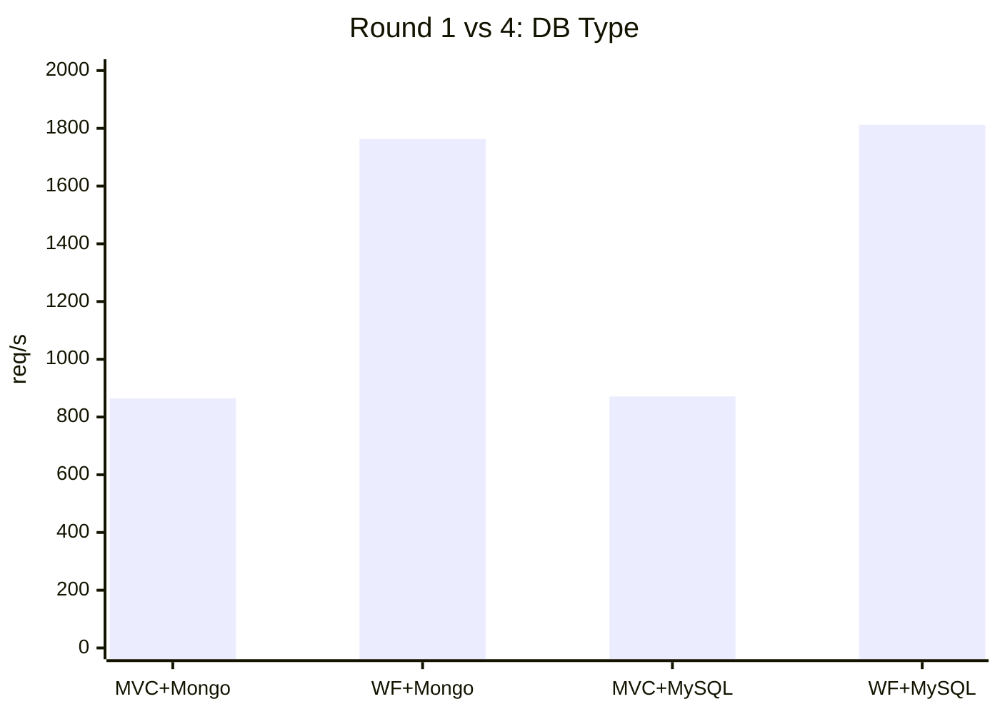

> **결론: DB 종류(MongoDB vs MySQL)에 관계없이 블로킹 vs 논블로킹 전체 스택의 차이가 성능을 결정한다.** 동일한 2배의 성능 격차.

---

# Round 5: 실제 네트워크 지연 시뮬레이션

> **질문: 실제 운영 환경처럼 DB가 원격에 있으면 어떻게 되는가?**

## 구성

앱 레벨의 `Thread.sleep`/`delay`를 제거하고, **toxiproxy**로 DB 앞에 200ms 네트워크 지연을 주입.

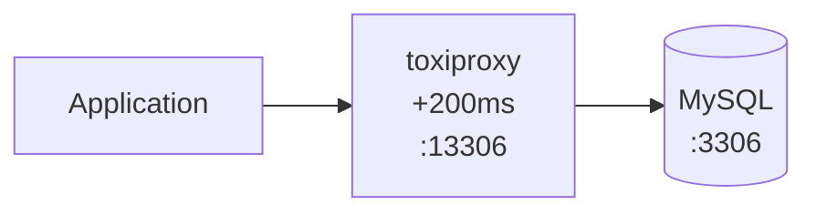

## 설정 코드

**docker-compose.yml — toxiproxy 추가**

```yaml
toxiproxy:
  image: ghcr.io/shopify/toxiproxy:latest
  container_name: perf-toxiproxy
  ports:
    - "8474:8474"    # toxiproxy API
    - "13306:13306"  # MySQL proxy (with latency)
  depends_on:
    mysql:
      condition: service_healthy
```

**toxiproxy 설정 — 200ms 지연 주입**

```bash
# MySQL 프록시 생성
curl -X POST http://localhost:8474/proxies \
  -d '{"name":"mysql","listen":"0.0.0.0:13306","upstream":"perf-mysql:3306"}'

# 200ms 네트워크 지연 추가
curl -X POST http://localhost:8474/proxies/mysql/toxics \
  -d '{"name":"latency","type":"latency","attributes":{"latency":200,"jitter":0}}'
```

**application.yml — 앱 레벨 delay 제거, toxiproxy 경유 접속**

```yaml
# MVC
spring.datasource.url: jdbc:mysql://localhost:13306/userdb  # toxiproxy 경유
app.simulate-delay-ms: 0  # 앱 레벨 delay 제거

# WebFlux
spring.r2dbc.url: r2dbc:mysql://localhost:13306/userdb  # toxiproxy 경유
app.simulate-delay-ms: 0  # 앱 레벨 delay 제거
```

이전 Round와의 차이:
- **Round 1~4**: 앱 코드에서 `sleep`/`delay`로 지연 시뮬레이션 → 쿼리 1회당 지연 1회
- **Round 5**: 네트워크 레벨 지연 → **커넥션 맺기, 쿼리, 응답 각 단계마다 지연 누적**

## 결과

| 지표 | MVC + JPA | WebFlux + R2DBC | 배수 |
|------|----------|----------------|------|
| **Samples** | 1,024 | **1,956** | 1.9x |
| **Avg (ms)** | 32,485 | **14,120** | 2.3x 빠름 |
| **Min (ms)** | 1,414 | **407** | 3.5x 빠름 |
| **Max (ms)** | 61,659 | **20,535** | 3.0x 빠름 |
| **Throughput** | 9.7 | **24.3** | 2.5x |
| **Error %** | **16.99%** | **0%** | MVC만 에러 |

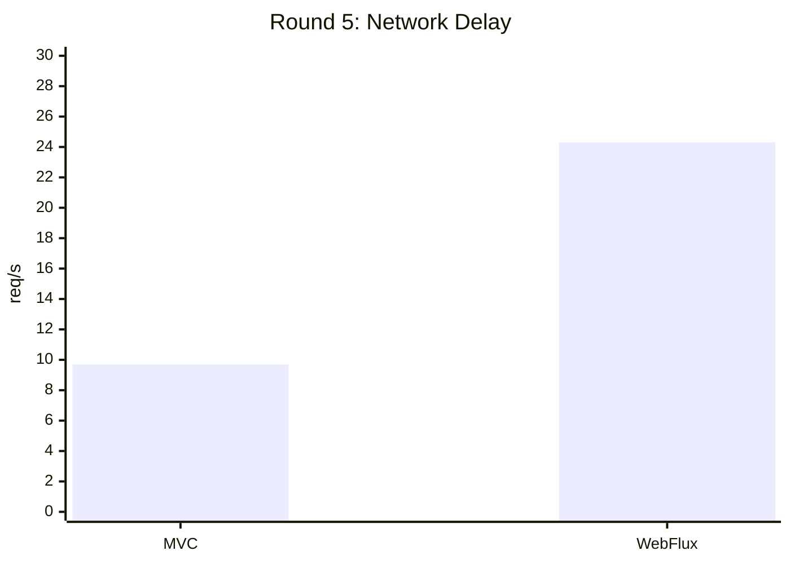

## Round 4 vs Round 5 비교 (앱 지연 vs 네트워크 지연)

| 지표 | Round 4 MVC | Round 5 MVC | Round 4 WebFlux | Round 5 WebFlux |
|------|------------|------------|----------------|----------------|
| Throughput | 871 req/s | **9.7 req/s** | 1,812 req/s | **24.3 req/s** |
| Avg (ms) | 429 | **32,485** | 206 | **14,120** |
| Error % | 0% | **17%** | 0% | 0% |

> **네트워크 지연은 앱 레벨 지연과 차원이 다르다.** DB 통신의 모든 단계(TCP 핸드셰이크, 쿼리 전송, 결과 수신)에 지연이 곱해지기 때문.
>
> **가장 중요한 포인트: MVC는 에러가 발생했지만 WebFlux는 에러 0%.** HikariCP 커넥션풀(10개) + Tomcat 스레드풀이 모두 포화되면 타임아웃이 발생한다. WebFlux + R2DBC는 논블로킹 커넥션으로 느리지만 안정적으로 처리.

---

# 전체 결과 요약

**Round 1~2: 프레임워크 비교**

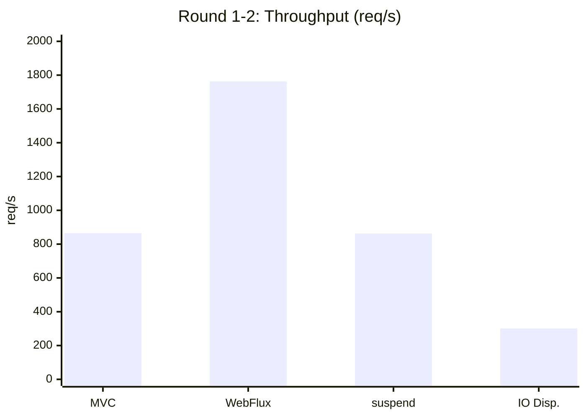

**Round 3: 순차 vs 병렬**

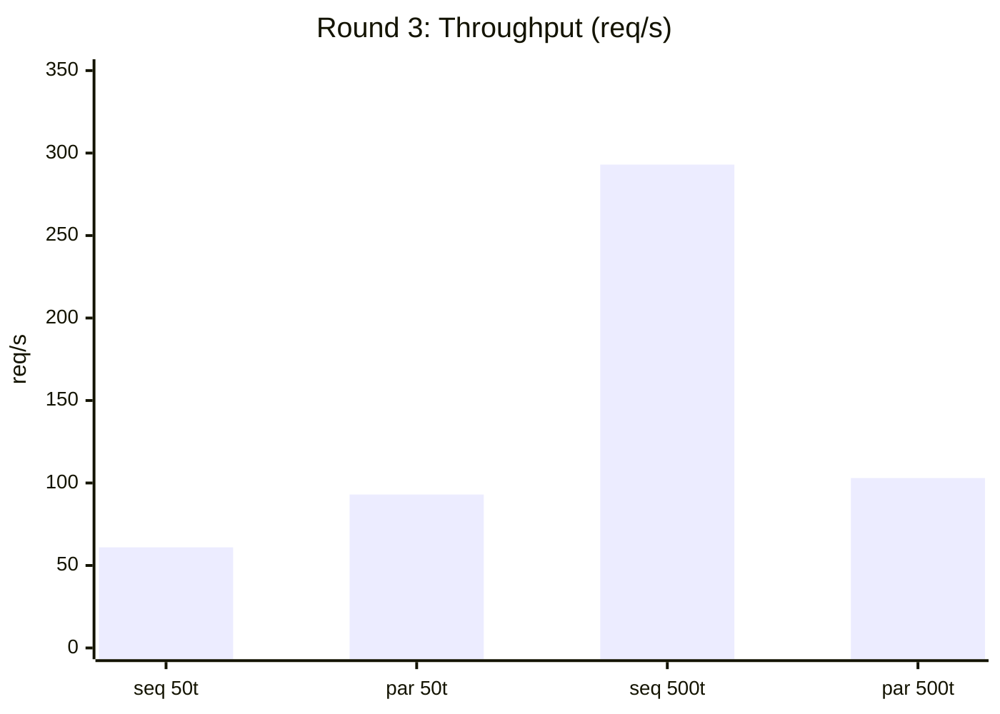

**Round 4~5: MySQL + 네트워크 지연**

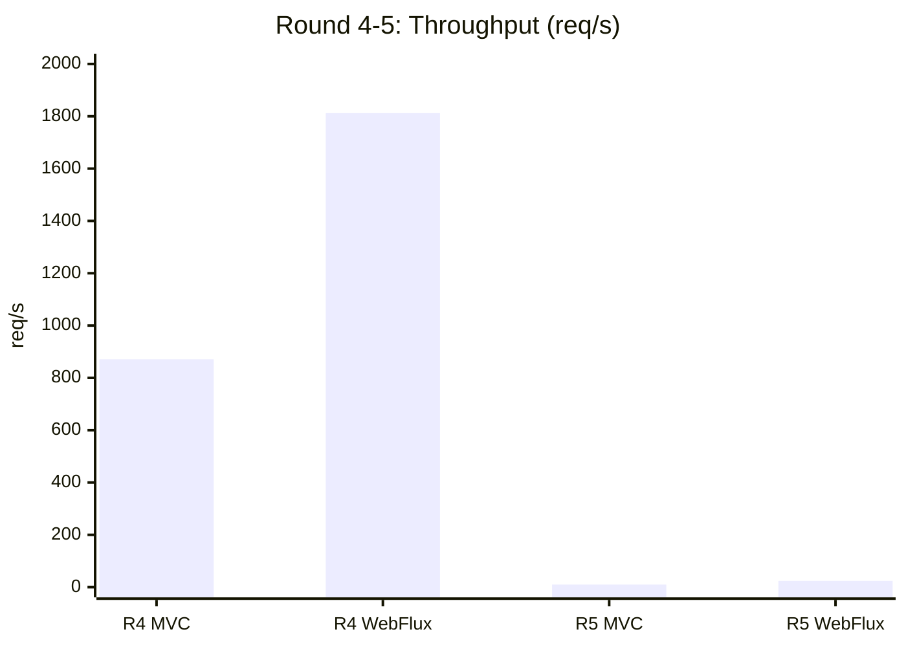

## 한눈에 보는 결론

| # | 테스트 | 결론 |
|---|--------|------|
| **1** | MVC vs WebFlux (MongoDB) | WebFlux **2배 빠름**, 압도적으로 안정 |
| **2-a** | MVC + suspend fun | **효과 없음** — 키워드만으로 논블로킹 안 됨 |
| **2-b** | MVC + Dispatchers.IO | **오히려 3배 악화** — 병목이 이동할 뿐 |
| **3** | 코루틴 병렬 호출 (500명) | **오히려 3배 느림** — IO 풀 포화 |
| **3** | 코루틴 병렬 호출 (50명) | **1.5배 빠름** — 저부하에서만 효과 |
| **4** | MVC vs WebFlux (MySQL) | WebFlux **2배 빠름** — DB 종류 무관 |
| **5** | 네트워크 지연 시뮬레이션 | WebFlux **2.5배 빠름** + MVC 에러 17% |

---

# 핵심 교훈

## 1. 논블로킹은 전체 스택이어야 의미가 있다

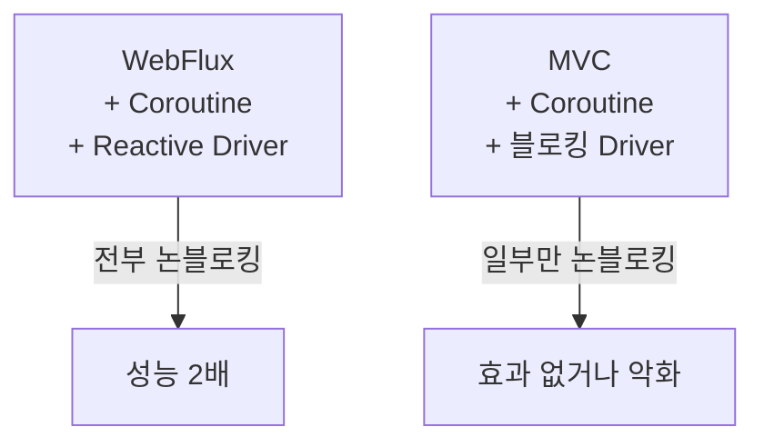

`suspend fun`을 붙이는 것만으로는 부족하다. **Controller → Service → Repository → DB Driver** 전체가 논블로킹이어야 한다.

## 2. Dispatchers.IO는 만능이 아니다

블로킹 코드를 `withContext(Dispatchers.IO)`로 감싸면 "Tomcat 스레드를 해방"할 수 있지만, **IO 스레드풀(기본 64개)이 새로운 병목**이 된다. 동시 사용자가 많을수록 악화.

## 3. 코루틴 병렬 호출은 조건부

| 조건 | 효과 |
|------|------|
| 동시 사용자 적음 + 독립적 I/O 호출 | ✅ 유효 |
| 동시 사용자 많음 | ❌ IO 풀 포화로 역효과 |

## 4. 네트워크 지연이 있는 운영 환경에서 WebFlux의 가치는 극대화된다

앱 레벨 200ms delay에서는 MVC도 에러 없이 처리했지만, 네트워크 레벨 200ms 지연에서는 **MVC만 에러율 17%가 발생**했다. 실제 운영 환경에서 DB가 원격에 있다면, WebFlux + 논블로킹 드라이버는 성능뿐 아니라 **안정성**에서도 필수적이다.

## 5. lucida-builder-r3의 WebFlux + Coroutine 선택은 올바르다

datasource 모듈이 외부 DB에 접근하는 구조라면, 네트워크 지연은 불가피하다. 이 환경에서 WebFlux + Coroutine + Reactive Driver 조합은 단순 MVC 대비 **처리량 2배 이상, 에러율 제로**를 보장한다.

---

# 테스트 결과 파일 목록

| Round | 파일명 | 설명 |
|-------|--------|------|
| 1 | `round1-mvc-mongodb-delay200-t500.csv` | MVC + MongoDB |
| 1 | `round1-webflux-mongodb-delay200-t500.csv` | WebFlux + MongoDB |
| 2 | `round2-mvc-mongodb-delay200-t500.csv` | MVC (기준) |
| 2 | `round2-mvc-coroutine-mongodb-delay200-t500.csv` | MVC + suspend fun |
| 2 | `round2-mvc-coroutine-io-mongodb-delay200-t500.csv` | MVC + Dispatchers.IO |
| 3 | `round3-mvc-sequential-mongodb-delay200-t500.csv` | 순차 호출 (500t) |
| 3 | `round3-mvc-coroutine-parallel-mongodb-delay200-t500.csv` | 병렬 호출 (500t) |
| 3 | `round3-mvc-sequential-mongodb-delay200-t50.csv` | 순차 호출 (50t) |
| 3 | `round3-mvc-coroutine-parallel-mongodb-delay200-t50.csv` | 병렬 호출 (50t) |
| 4 | `round4-mvc-jpa-mysql-delay200-t500.csv` | MVC + JPA + MySQL |
| 4 | `round4-webflux-r2dbc-mysql-delay200-t500.csv` | WebFlux + R2DBC + MySQL |
| 5 | `round5-mvc-jpa-mysql-netdelay200-t500.csv` | MVC + 네트워크 지연 |
| 5 | `round5-webflux-r2dbc-mysql-netdelay200-t500.csv` | WebFlux + 네트워크 지연 |
